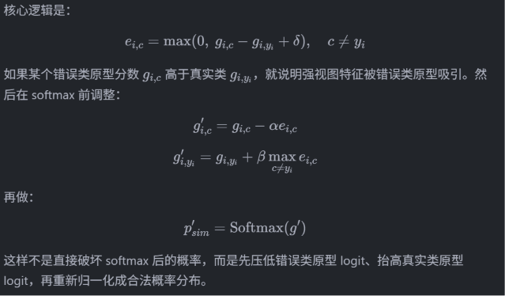

# CRLD-Proto 实验记录

更新时间：2026-07-14

## 76.80 版改进



当前磁盘配置对应 `logit_soft_a05_m005`：

```yaml
EXPERIMENT:
  TAG: "crld_proto,res32x4,res8x4,logit_soft_a05_m005"

CRLD:
  TEMPERATURE: 4.0
  TAU_W: 0.8
  PROTO_TEMP: 0.5
  PROTO_MAX_WEIGHT: 1.0
  PROTO_MIN_WEIGHT: 0.0
  PROTO_TAU_W: 0.80
  LOGIT_SWAP: True
  LOGIT_SWAP_ALPHA: 0.5
  LOGIT_SWAP_MARGIN: 0.05
  LOGIT_SWAP_DISABLE_PROTO: True
```

## Base 统一实验流程

1. 使用 CIFAR-100 双视图训练流程，弱视图 `x_w` 和强视图 `x_s` 同时输入学生网络。
2. 使用预训练教师模型提取弱视图教师特征 `f_w^T`。
3. 构建原型时，仅使用满足以下条件的可靠样本：

$$
\mathrm{Mask}_i
=
\mathbb{I}\left(\mathrm{Conf}_{w,i}^{T}\ge \tau_w\right)
\cdot
\mathbb{I}\left(\hat{y}_{w,i}^{T}=y_i\right)
$$

LaTeX 源码：

```latex
\mathrm{Mask}_i
=
\mathbb{I}\left(\mathrm{Conf}_{w,i}^{T}\ge \tau_w\right)
\cdot
\mathbb{I}\left(\hat{y}_{w,i}^{T}=y_i\right)
```

4. 对每个类别的可靠弱视图教师特征执行 K-Means，得到每类 `K=3` 个子原型。
5. 使用 GLVQ 对多中心原型进行判别式微调，并对原型做 L2 归一化。
6. Base 训练学生时使用联合 CE 和 KD：
   - 弱视图学生对齐弱视图教师软标签。
   - 强视图学生对齐原型先验修正后的强视图教师软标签。
7. Base 主线使用概率级融合：

$$
\hat{p}_{s,i}^{T}
=
(1-\lambda_i)\widetilde{p}_{s,i}^{T}
+
\lambda_i p_{\mathrm{sim},i}
$$

LaTeX 源码：

```latex
\hat{p}_{s,i}^{T}
=
(1-\lambda_i)\widetilde{p}_{s,i}^{T}
+
\lambda_i p_{\mathrm{sim},i}
```

## 参数说明

| 参数                 | 含义                                                        |
| -------------------- | ----------------------------------------------------------- |
| `TEMPERATURE`      | KD 蒸馏温度`T`，控制教师软标签平滑程度                    |
| `TAU_W`            | 训练 KD 时弱视图教师置信度阈值                              |
| `PROTO_TEMP`       | 原型温度`tau_p`，控制原型相似度分布尖锐程度               |
| `PROTO_AGG_MODE`   | 多原型聚合方式，`logsumexp` 为软聚合，`max` 为 hard max |
| `PROTO_MAX_WEIGHT` | 原型先验融合权重`lambda_i` 的最大值                       |
| `PROTO_MIN_WEIGHT` | 原型先验融合权重`lambda_i` 的最小值                       |
| `PROTO_TAU_W`      | 构建原型时的弱视图教师置信度阈值                            |
| `CE_WEIGHT`        | 交叉熵损失权重                                              |
| `KD_WEIGHT`        | KD 损失权重                                                 |

## ResNet32x4 -> ResNet8x4 主线实验

| 实验                            | 配置/Tag                                                 | 核心改动                                                                   | 关键参数                                                                                     | Best Acc | 记录来源                 | 结论                                       |
| ------------------------------- | -------------------------------------------------------- | -------------------------------------------------------------------------- | -------------------------------------------------------------------------------------------- | -------: | ------------------------ | ------------------------------------------ |
| Base 历史最好                   | `crld_proto,res32x4,res8x4`                            | 多中心原型 + log-sum-exp 聚合 + 概率级融合                                 | `T=4.0`, `TAU_W=0.8`, `PROTO_TEMP=0.5`, `PROTO_MAX_WEIGHT=1.0`, `PROTO_TAU_W=0.80` |    76.95 | `worklog.txt` 历史记录 | 当前确认的历史最好结果                     |
| Logit hard swap                 | `crld_proto,res32x4,res8x4,logit_swap`                 | 强视图教师 logits 中交换真实类与最强错误类，关闭原型融合                   | `LOGIT_SWAP_ALPHA=1.0`, `LOGIT_SWAP_MARGIN=0.0`                                          |    76.54 | 实验记录                 | 过度校正，低于 base                        |
| Logit soft correction           | `crld_proto,res32x4,res8x4,logit_soft_a05_m005`        | 按错误类与真实类的 logit 间隔进行软校正，关闭原型融合                      | `LOGIT_SWAP_ALPHA=0.5`, `LOGIT_SWAP_MARGIN=0.05`                                         |    76.80 | `worklog.txt`          | 高于 hard swap，但仍低于历史最好           |
| Logit soft + prototype gate     | `crld_proto,res32x4,res8x4,logit_soft_proto_gate_l025` | 软 logits 校正，并以原型可靠性门控小权重原型先验                           | `PROTO_MAX_WEIGHT=0.25`                                                                    |    76.76 | `worklog.txt`          | 原型小辅助未带来额外提升                   |
| 原型一致性门控                  | `crld_proto,res32x4,res8x4,ablate_consistency`         | 仅当原型预测与弱视图教师一致时使用原型先验                                 | base +`PROTO_CONSISTENCY_GATE=True`                                                        |    76.10 | 口头/消融记录            | 低于 base，硬门控削弱有效修正              |
| 一致性 + margin 门控            | `crld_proto,res32x4,res8x4,ablate_consistency_margin`  | 增加原型 top-1/top-2 margin 过滤                                           | base + consistency + margin                                                                  |    76.55 | 口头/消融记录            | 仍低于 base                                |
| 一致性 + margin + 自适应 lambda | `crld_proto,res32x4,res8x4,ablate_full`                | 再按原型置信度缩放`lambda_i`                                             | base + consistency + margin + adaptive lambda                                                |    76.40 | 口头/消融记录            | 仍低于 base                                |
| Hard max 聚合                   | `crld_proto,res32x4,res8x4,hardmax`                    | 用最大子原型相似度替换 log-sum-exp 聚合                                    | `PROTO_AGG_MODE=max`, `PROTO_TEMP=0.5`                                                   |    76.20 | 口头记录                 | 低于 log-sum-exp，说明软聚合更稳           |
| Soft refine 多样本加权          | `softrefine`                                           | 错误/低可信样本按教师类别概率软加权加入原型                                | `PROTO_REFINE_CONF_POWER` 调参                                                             |    76.67 | 口头记录                 | 覆盖率提高但污染原型，效果下降             |
| Z-Score logit 对齐              | `crld_proto,res32x4,res8x4,rawlogit_hardmax_tp005`     | 去掉原型温度，将 hard-max cosine 按样本级 Z-Score 对齐到教师 logits/T 空间 | `PROTO_AGG_MODE=max`, `PROTO_FUSION_MODE=zscore_logit`, 无 `PROTO_TEMP`                |    76.53 | `worklog.txt`          | 低于 raw-logit hardmax，对低方差样本加保护 |

## 其他模型组合实验

| 配置/Tag                         | Teacher -> Student    | 关键参数                                                                                    | 当前记录 Acc | 对应基线 Acc | 记录来源        | 结论                 |
| -------------------------------- | --------------------- | ------------------------------------------------------------------------------------------- | -----------: | -----------: | --------------- | -------------------- |
| `crld_proto,res110,res32`      | ResNet110 -> ResNet32 | `T=4.0`, `TAU_W=0.8`, `PROTO_TEMP=0.5`, `PROTO_MAX_WEIGHT=1.0`, `KD_WEIGHT=1.0`   |        74.52 |        74.42 | `worklog.txt` | 略高于基线           |
| `crld_proto,wrn_40_2,wrn_16_2` | WRN-40-2 -> WRN-16-2  | `T=4.0`, `TAU_W=0.85`, `PROTO_TEMP=0.45`, `PROTO_MAX_WEIGHT=1.0`, `KD_WEIGHT=1.2` |        76.03 |        76.45 | `worklog.txt` | 仍低于基线           |
| `crld_proto,wrn_40_2,wrn_40_1` | WRN-40-2 -> WRN-40-1  | `T=4.0`, `TAU_W=0.8`, `PROTO_TEMP=0.6`, `PROTO_MAX_WEIGHT=0.7`, `KD_WEIGHT=1.0`   |        75.34 |        75.58 | `worklog.txt` | 仍低于基线           |
| `crld_proto,vgg13,vgg8`        | VGG13 -> VGG8         | `T=4.0`, `TAU_W=0.8`, `PROTO_TEMP=0.7`, `PROTO_MAX_WEIGHT=0.6`, `KD_WEIGHT=1.0`   |        74.98 |        75.27 | `worklog.txt` | 仍低于基线           |
| `crld_proto,res56,res20`       | ResNet56 -> ResNet20  | `T=3.0`, `TAU_W=0.8`, `PROTO_TEMP=0.5`, `PROTO_MAX_WEIGHT=1.0`, `KD_WEIGHT=1.0`   |        72.15 |        72.10 | `worklog.txt` | 当前最好记录为 72.15 |
